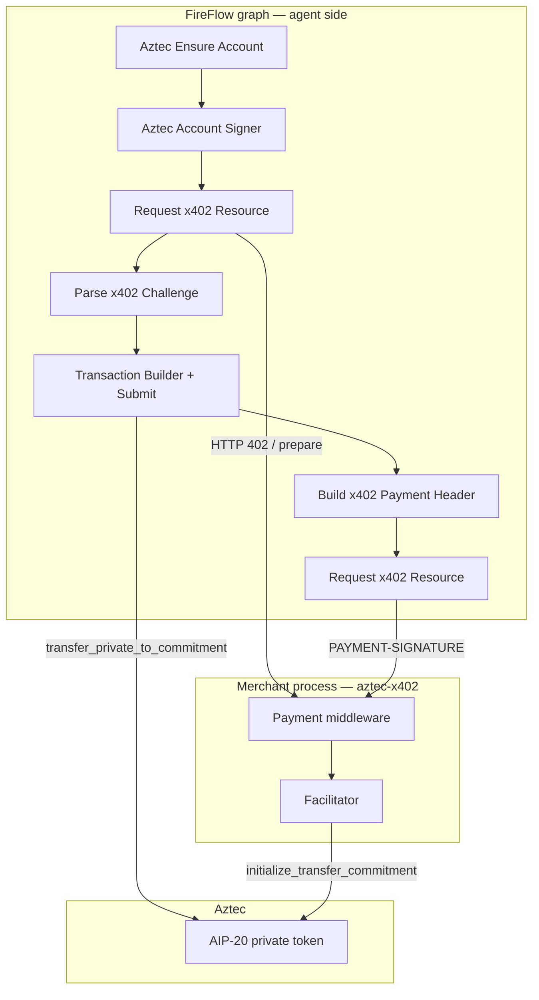
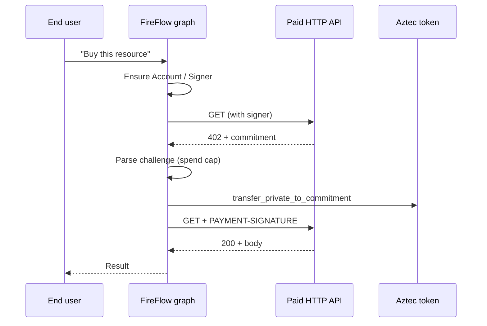

# FireFlow × x402

An overview of how [FireFlow](https://github.com/Persistent-AI/fireflow) agents pay for HTTP resources privately on Aztec using Overcast x402.

This is not the node-by-node engineering spec. Port shapes, execution flags, and edge cases live in [fireflow-overcast/docs/specification.md](https://github.com/Galactica-corp/fireflow-overcast/blob/main/docs/specification.md). The protocol those nodes speak is [private-stablecoin-specification.md](./private-stablecoin-specification.md).

The Apache snapshot of the nodes is `[@persistent-ai/fireflow-overcast](https://github.com/Galactica-corp/fireflow-overcast)`. The payment libraries they call are the `@galactica-net/x402-*` packages in this repository.

---

## 1. What this is for

FireFlow is a flow-based engine for building **agents with guardrails** — including agents for financial work. Overcast adds a payment rail those agents can use: **x402 on Aztec**, so an agent can buy an API call, a data feed, or another HTTP resource with a **private stablecoin** transfer.

The person chatting with the agent does not need to understand 402 headers. The flow author wires a small set of Aztec and x402 nodes. At runtime the graph:

1. Makes sure the **caller** has an Aztec account (created for them, keys in their vault).
2. Hits a paid URL.
3. If the server asks for payment, completes a private transfer under a **spend cap**.
4. Retries with proof and returns the resource to the rest of the flow.

Privacy on the Aztec leg: sender, recipient, and amount are not visible on a public explorer. The merchant still learns that *this* request was paid, which is required to serve the resource.

---

## 2. Where the pieces live

- **Agent / buyer** — FireFlow nodes in `fireflow-overcast`. They never run the merchant facilitator.
- **Merchant / seller** — `@galactica-net/x402-middleware` plus a facilitator signer that holds the merchant Aztec account. The weather-API demo in this repo is the reference.
- **Token** — any AIP-20 private token the merchant advertises as `asset` (sandbox oUSD in the demo; zk.money, human.tax, and others in production). FireFlow does not ship a token.

The engine itself is not in the public Overcast snapshot. Nodes typecheck and run against a FireFlow checkout (`@persistent-ai/fireflow-types`).

---

## 3. Nodes, at a glance

Each node is one operation with typed inputs and outputs. Authors compose them into graphs the way they would compose tools.

### 3.1 Account (who pays)

| Node                     | What a person should know                                                                                                                                                                                 |
| ------------------------ | --------------------------------------------------------------------------------------------------------------------------------------------------------------------------------------------------------- |
| **Aztec Ensure Account** | Get-or-create the **current user’s** Aztec account. Keys stay in that user’s vault as an `aztec-account` secret. The node only emits a public pointer + address (`AztecAccountRef`). No secrets on wires. |
| **Aztec Account Signer** | Turns that pointer into a signing handle (`AztecSignerRef`). Still no keys on ports. Simulate, Submit, and x402 rehydrate the live wallet when they actually need it.                                     |

Accounts are **initializerless Schnorr** on Aztec **5.0.1**. Addresses are version-specific; a v4 account cannot be reused on v5. The signing key is required and must not be passed between nodes.

The account belongs to the **end user in the conversation**, not to the person who published the flow. A returning user hits the found-path and keeps the same address.

### 3.2 General Aztec (any contract)

These are not payment-specific. They exist so the same graph can read a balance, drip from a faucet, or call any Aztec method.

| Node                          | What a person should know                                                      |
| ----------------------------- | ------------------------------------------------------------------------------ |
| **Parse Contract Artifact**   | Points at a contract ABI JSON in the workspace and checks it.                  |
| **Aztec Smart Contract**      | “This address on this network is that artifact.”                               |
| **Get Fee Payer**             | How fees are paid: native fee juice or **Sponsored FPC** (typical on testnet). |
| **Aztec Transaction Builder** | Names a method and argument list on a contract. Does not send anything.        |
| **Simulate Transaction**      | Local read / dry-run (for example `balance_of_private`).                       |
| **Submit Aztec Transaction**  | Sends the tx, optionally waits for confirmation, returns tx hash and receipt.  |

For x402, Parse Challenge outputs the method name `transfer_private_to_commitment` and its arguments; Builder + Submit are the on-chain settlement step.

### 3.3 x402 commerce

| Node                          | What a person should know                                                                                                                                                                                                                                                      |
| ----------------------------- | ------------------------------------------------------------------------------------------------------------------------------------------------------------------------------------------------------------------------------------------------------------------------------ |
| **Request x402 Resource**     | Ordinary HTTP call. If the URL is payment-gated and a signer is attached, it also runs the **prepare** round-trip and returns a 402 **challenge** (commitment, amount, asset, payTo, nonce). After payment, call it again with the payment header to get **200** and the body. |
| **Parse x402 Challenge**      | Policy gate. Checks the challenge against a **max amount** (required) and optional expected token / merchant. Emits the token method + args to settle, plus a payment context for the header.                                                                                  |
| **Build x402 Payment Header** | After a successful (or still-pending) settlement tx, builds the `PAYMENT-SIGNATURE` header. Refuses if the receipt says the tx reverted or dropped.                                                                                                                            |

Delegated KYC, Create AuthWit, and human-in-the-loop wallet approval appear in the detailed node spec. They are **not in the pilot package**. ZK KYC is unused on this path until a use case states requirements — see the [protocol spec §4](./private-stablecoin-specification.md#4-zk-kyc-designed-not-in-the-payment-path).

---

## 4. Paying for a resource (happy path)

This is the graph the integration test exercises, described as a story.

1. **Ensure Account → Account Signer** — the caller can sign.
2. **Request x402 Resource** (first time) — `GET` the paid URL with the signer attached.
  - Unpaid: HTTP 402.
  - The node sends `X-402-PREPARE` with the caller’s Aztec address.
  - The merchant creates a partial note (`initialize_transfer_commitment`) and returns a **commitment**.
3. **Parse x402 Challenge** — reject if the price is above `maxAmount`, if the token is not the expected asset, if `payTo` is not the expected merchant, or if the challenge is older than `maxTimeoutSeconds`. If the merchant sent an offchain message, register it (`offchain_receive`) so the buyer’s PXE can see the partial note.
4. **Get Fee Payer → Transaction Builder → Submit** — call `transfer_private_to_commitment(from, commitment, amount, 0)` on the token. This is the private payment.
5. **Build x402 Payment Header** — encode sender, tx hash, and challenge into `PAYMENT-SIGNATURE`.
6. **Request x402 Resource** (second time) — same URL, payment header set. Merchant verifies nonce + completion log, returns **200** and the payload.

The merchant finds the incoming note from the commitment it created and from the tx id the buyer sends. That is the partial-note answer to Aztec’s usual “recipient needs the sender address” discovery problem.

An HTTP-only client (no FireFlow) can do the same three phases with `wrapFetchWithPayment()` from `@galactica-net/x402-client`. FireFlow’s value is **composition and policy**: the spend cap is a node input the author sets, not an afterthought in application code.

---

## 5. Guardrails (why this is fit for financial agents)

FireFlow is used for financial agents because the graph can constrain what the model is allowed to do. On the payment path, the important controls that **exist in the pilot** are:

| Control              | Where                                            | Effect                                                                                           |
| -------------------- | ------------------------------------------------ | ------------------------------------------------------------------------------------------------ |
| Spend cap            | Parse x402 Challenge `maxAmount`                 | Challenge amount must be a non-negative integer in token base units and must not exceed the cap. |
| Expected token       | `expectedAsset` (optional)                       | 402 `asset` must be this contract address.                                                       |
| Expected merchant    | `expectedPayTo` (optional)                       | 402 `payTo` must be this Aztec address.                                                          |
| Challenge timeout    | `maxTimeoutSeconds` on the 402, checked at parse | Stale invoices cannot be paid.                                                                   |
| Failed settlement    | Build Payment Header                             | No header if the receipt is reverted/dropped.                                                    |
| Keys off the graph   | Ensure Account                                   | Signing material never appears on ports or in the event stream.                                  |
| Caller-owned account | Ensure Account                                   | A published flow cannot silently spend the author’s wallet; it spends the **caller’s** account.  |

The chain, in the permissionless pilot, does **not** enforce KYC, per-agent allowances, or a recipient whitelist. Those belong to a future token policy or to Delegated KYC nodes once a use case defines them.

Human-in-the-loop approval (user connects a wallet in the UI and signs instead of the vault key) is specified for later, not shipped.

---

## 6. What the agent author still has to supply

- **Token contract address and artifact** — FireFlow does not hard-code oUSD, zk.money, or human.tax. The graph binds whatever AIP-20 (or adapter-compatible) token the merchant charges.
- **Network** — sandbox, testnet, or later mainnet; account addresses differ per network.
- **Fee strategy** — Sponsored FPC is the usual testnet choice so a new account can transact without holding fee juice.
- `maxAmount` — required. A flow that omits it cannot parse a challenge.
- **Merchant URL** — x402 is HTTP-native; there is no on-chain marketplace in this spec.

zk.money may need a **conclave-signature billing adapter** at the settlement call (see the [protocol spec §3.2](./private-stablecoin-specification.md#32-zkmoney)). Until that adapter exists, Parse Challenge still emits `transfer_private_to_commitment`. A zk.money-aware flow would swap only that on-chain step.

---

## 7. Merchant side (not FireFlow nodes)

Serving a paid API is out of scope for `fireflow-overcast` on purpose. Use this repo:

- Declare routes: network, asset, amount, payTo, timeout.
- Run `createPaymentMiddleware` in the HTTP server.
- Back it with `ExactAztecFacilitatorScheme` and a signer that can `prepareCommitment` and `verifyPayment`.

In the pilot the facilitator **is** the merchant process. Prepare costs the merchant an Aztec transaction, so public endpoints need rate limits.

The demo gates a weather URL and an “achievement skill” markdown file at $0.01 of the sandbox token. That is a stand-in for any agent-consumable HTTP resource.

---

## 8. Pilot status versus the detailed node spec

| In the public node package today                | Specified for later / parked               |
| ----------------------------------------------- | ------------------------------------------ |
| Ensure Account, Account Signer                  | Delegated KYC / Know Your Agent            |
| Artifact, Smart Contract, Fee Payer             | Create AuthWit as a standalone node        |
| Transaction Builder, Simulate, Submit           | Human-in-the-loop payment approval (AG-UI) |
| Request Resource, Parse Challenge, Build Header | ZK KYC proofs on the transfer              |
| Spend cap and expected asset / payTo            | Cross-chain funding of the agent budget    |
|                                                 | State channels for per-call micropayments  |

Direct private transfers (not x402) are already possible: point Transaction Builder at `transfer_in_private` (or the token’s equivalent) instead of the x402 settlement method. x402 is the commerce path when the counterparty is an HTTP service.

---

## 9. Next steps that affect FireFlow

**State channels.** Paying on-chain for every API call is correct and auditable, and it is what the pilot does. For high-frequency agent micropayments it will be too slow and too expensive. Channels (or a similar off-chain construction) are the high-leverage follow-on for Overcast **or** for the token. They are out of the current nodes because the complexity jump is large; we want the on-chain 402 path solid first. When channels exist, FireFlow should gain nodes that open, update, and settle a channel under the same spend-cap style of guardrail.

**Cross-chain funding.** Graphs assume the caller’s private balance is already on Aztec. On-ramping (including human.tax bridged assets) is a product step outside these nodes.

**AP2.** Later interoperability for agent-payment standards; not required to use FireFlow x402 today.

---

## 10. Related documents

| Document                                                                                                                       | Role                                                   |
| ------------------------------------------------------------------------------------------------------------------------------ | ------------------------------------------------------ |
| [private-stablecoin-specification.md](./private-stablecoin-specification.md)                                                   | Overcast as a token-agnostic private payments protocol |
| [fireflow-overcast/docs/specification.md](https://github.com/Galactica-corp/fireflow-overcast/blob/main/docs/specification.md) | Full node inputs, outputs, and behavior                |
| [aztec-x402 readme](../readme.md)                                                                                              | Protocol flow, packages, anti-replay, demo             |
| [x402.org](https://www.x402.org)                                                                                               | HTTP 402 payment standard                              |

