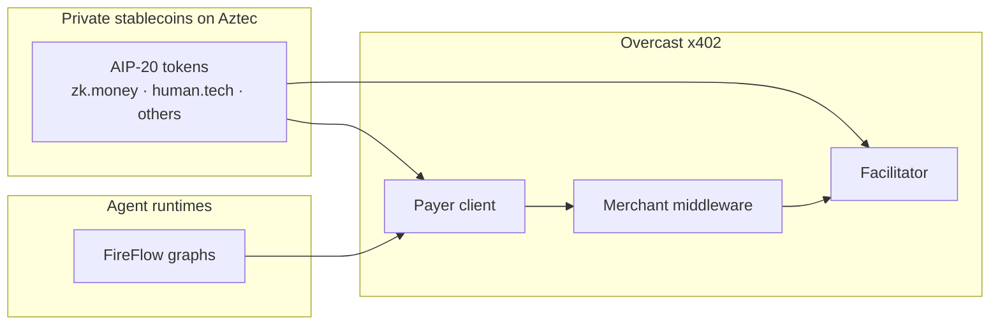
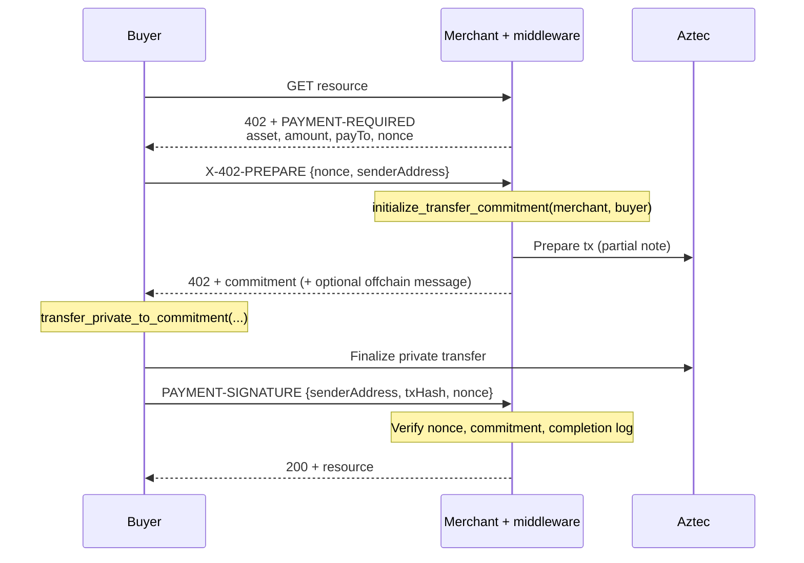

# Overcast private payments

This document updates the original private-stablecoin specification. Overcast is no longer a plan to issue and operate our own stablecoin. It is a **private payments protocol on Aztec** that any AIP-20-compatible private stablecoin can plug into, with **x402** as the HTTP commerce layer.

The first integration targets are third-party tokens such as the upcoming **zk.money** token and **human.tech** bridge stablecoins. The x402 stack is open to both. It orients itself at the [Wonderland AIP-20](https://github.com/AztecProtocol/aztec-standards) token standard rather than at a custom Overcast token contract.

The current focus is **agentic payments**: AI agents that buy digital goods and APIs privately. The primary runtime is [FireFlow](https://github.com/Persistent-AI/fireflow) — see [fireflow-x402-specification.md](./fireflow-x402-specification.md).

Pilot implementations live in:

- [aztec-x402](https://github.com/Galactica-corp/aztec-x402) — x402 client, middleware, facilitator, and demo
- [fireflow-overcast](https://github.com/Galactica-corp/fireflow-overcast) — FireFlow graph nodes for agent-side Aztec accounts and x402 settlement
- [aztec-zkkyc](https://github.com/Galactica-corp/aztec-zkkyc) — ZK KYC on Aztec (designed, not wired into the payment path today)

## 1. System overview

Overcast sits between **private stablecoins on Aztec** and **machine-payable HTTP APIs**.




What this means in practice:

- **We do not issue a protocol coin.** Liquidity, compliance policy, and mint/burn rules belong to the token issuer (zk.money, human.tech, or a later issuer).
- **AIP-20 is the integration surface.** A token that implements Wonderland AIP-20 private balances and `initialize_transfer_commitment(to, completer)` can be used for x402 without a fork of the token contract.
- **x402 is token-agnostic.** The 402 challenge names an `asset` (token contract address), `amount`, and `payTo`. The same three-phase flow works for any supported token.
- **The protocol can be extended per token.** Depending on the stablecoin and its compliance requirements, Overcast x402 can grow extra steps on top of this baseline — for example attaching conclave signatures on private transfers (zk.money) or carrying ZK KYC compliance proofs when a use case requires them. Those extensions are adapters, not a different payment protocol.
- **Payments are private on-chain.** Sender, recipient, and amount stay in Aztec private state. The HTTP layer carries only what the merchant needs to correlate and verify a payment (nonce, commitment, tx hash).
- **The buyer is assumed to already hold the private token on Aztec.** Cross-chain on-ramping is a next step, not part of the current settlement path.

The local demo still deploys a sandbox token branded **Overcast USD (oUSD)**. That is a fixture for development and tests, not a product token.

---

## 2. User stories

### 2.1 Primary: autonomous agent commerce

**Actor:** An AI agent (and the person it acts for), plus an API or service provider.

**Story:** As an agent building a financial or operational workflow in FireFlow, I want to pay for HTTP resources privately with a stablecoin on Aztec, under spend caps and recipient checks, so I can complete a task without leaking the principal’s activity on a public ledger.

**Requirements:**

- Programmatic 402 handling: parse the challenge, complete a private transfer, prove payment, receive the resource.
- Guardrails the flow author can set (maximum amount, expected asset, expected merchant).
- An Aztec account that belongs to the **end user talking to the agent**, not to the flow author.
- Settlement that is verifiable by the merchant without revealing unrelated payments.

This is the story the pilot implements. FireFlow is the first agent system; the x402 libraries are usable from any HTTP client.

### 2.2 Merchant revenue privacy

**Actor:** A merchant or API operator.

**Story:** As a merchant, I want to accept private stablecoin payments into my Aztec account so competitors cannot read my volume, counterparties, or prices from a public explorer, while still knowing that *this* invoice was paid.

**Requirements:**

- Structural guarantee that funds went to the merchant (not a client-supplied recipient).
- Reliable correlation of payment to request (invoice / nonce).
- Ability to find the incoming note without brute-force decryption.

Solved in the current protocol by **partial notes** (commitment pattern) and the tx hash the buyer returns. See §5 and §6.

### 2.3 Consumer / principal privacy

**Actor:** A person whose agent (or who themselves) pays for a service.

**Story:** As a privacy-conscious user, I want the shop, amount, and my Aztec identity to stay off public explorers for the Aztec leg of the payment.

The current system covers the **Aztec private-transfer leg**. It does not yet hide the fact that a user funded an Aztec account from a public chain; that waits on cross-chain onboarding (§9).

### 2.4 Out of scope for this revision

The original spec also covered yield-bearing synthetics, Telegram Mini Apps as the primary storefront, L1 DeFi via Aztec’s public bridge, CMTA freeze/pause, and issuing Overcast’s own coin. Those are not current goals. **AP2** remains a later interoperability note (§10), not a delivery target for the pilot.

---

## 3. Token integration

### 3.1 AIP-20 as the default path

Overcast x402 is built against the published AIP-20 token from `[@aztec-foundation/aztec-standards](https://github.com/AztecProtocol/aztec-standards)`. The methods that matter for commerce are:


| Role                   | Method                                                            | Who calls it                                          |
| ---------------------- | ----------------------------------------------------------------- | ----------------------------------------------------- |
| Prepare                | `initialize_transfer_commitment(to, completer)`                   | Merchant / facilitator                                |
| Settle                 | `transfer_private_to_commitment(from, commitment, amount, nonce)` | Buyer                                                 |
| Optional note delivery | `offchain_receive(...)`                                           | Buyer, when the prepare tx yields an offchain message |


`to` is the merchant. `completer` is the buyer. That binding is why the merchant does not have to trust the buyer’s claim about *who* was paid.

A token is in-scope for the default adapter when it:

1. Holds **private balances** as AIP-20 notes.
2. Exposes the commitment / partial-note flow above (including a `completer`).
3. Emits the AIP-20 **note-completion log** keyed by the commitment, so the facilitator can read the settled amount in O(1).

Issuers keep their own mint, burn, pause, and compliance hooks. Overcast does not require a fork of the token for the default path.

### 3.2 [zk.money](http://zk.money)

zk.money is a first-class target token. The default AIP-20 client/facilitator path should apply for transfers that look like AIP-20.

**Adapter hook — conclave signatures.** zk.money needs a modification in the **transaction billing / settlement step**: the buyer’s completing transaction must be able to carry **conclave signatures**, which the unmodified AIP-20 `transfer_private_to_commitment` path does not know about.

Until zk.money publishes that interface, Overcast treats this as an extension point rather than a specified crypto scheme:

- Keep the HTTP x402 phases, nonce, commitment, and facilitator verification unchanged where possible.
- Swap the **on-chain billing call** (and only that call, if the rest of AIP-20 matches) for a zk.money-aware adapter that attaches conclave signatures.
- Do not bake conclave verification into the generic facilitator until the token’s billing ABI is stable.

### 3.3 human.tech bridge stablecoins

human.tech bridge stablecoins are the other initial integration. Once a human.tech token exists on Aztec as (or wrapped to) an AIP-20 private token, it is an `asset` in the 402 challenge like any other.

Bridging the underlying from another chain onto Aztec is **not** part of the current settlement path. See §9. The payment protocol assumes the payer already holds the private token.

### 3.4 Adding another token

A new issuer should not need a new x402 protocol. They need:

1. An AIP-20-compatible private token on Aztec (or a thin wrapper).
2. Optionally, a **billing adapter** if settlement is not `transfer_private_to_commitment` (the zk.money conclave case).
3. Merchants to advertise that token’s address as `asset` in their 402 routes.

---

## 4. ZK KYC

The original design attached **Galactica ZK KYC** to transfers so a private stablecoin could meet issuer or jurisdictional rules without a transparent ledger.

That work remains relevant. It is **not used in the current x402 or FireFlow payment path**, because wiring it in requires **concrete requirements from a use case** (who must be identified, at what threshold, disclosed to whom, and whether agents inherit a parent identity). Until an issuer or regulated flow states those rules, adding KYC proofs would be speculative.

The intended model, for when a use case appears:


| Level               | Meaning                                                                                                           |
| ------------------- | ----------------------------------------------------------------------------------------------------------------- |
| 0 Permissionless    | No identity check. Current pilot.                                                                                 |
| 1 ZK KYC            | Sender proves they hold a valid KYC attestation from the ZK KYC contract, without revealing the underlying PII.   |
| 2 Active monitoring | Level 1 plus selective disclosure: transfer details encrypted to an auditor / issuer key when the policy says so. |


Related ideas that stay parked with this section:

- **Delegated KYC / “Know Your Agent”** — a parent identity issues an AuthWit (and bundled compliance proofs) so an agent can spend under limits. Specified at node level in FireFlow; not implemented in the pilot.
- **aztec-zkkyc** — the standalone KYC protocol on Aztec. Overcast should consume it when a token or corridor actually requires it, not the other way around.

Compliance hooks belong to the **token issuer**, not to the x402 libraries. x402 should stay able to carry extra fields in the 402 challenge (for example a future `compliance_req`) without making KYC mandatory for permissionless tokens.

---

## 5. x402 commerce module

Overcast implements [x402](https://www.x402.org) for Aztec private tokens. EVM x402 typically relies on ERC-3009-style signed authorizations that a facilitator submits. Aztec private notes do not work that way: the **recipient** must create the partial note, and the **payer** must complete it.

### 5.1 Three-phase flow




1. **Challenge.** The merchant returns HTTP 402 with payment requirements: network, asset, amount, payTo, `maxTimeoutSeconds`, and a server-generated **UUID v7 nonce** in `extra`.
2. **Prepare.** The buyer sends its Aztec address. The merchant’s facilitator calls `initialize_transfer_commitment(merchant, buyer)` and returns the **commitment**. Optionally it forwards an offchain message so the buyer can `offchain_receive` before completing.
3. **Pay and prove.** The buyer completes the partial note, then retries the resource with `PAYMENT-SIGNATURE` carrying `senderAddress`, `txHash`, and the same nonce. The merchant verifies and serves the resource.

Communication between buyer and merchant is off-chain (HTTP). Only prepare and finalize hit Aztec.

### 5.2 Why commitments (partial notes)

A direct `transfer_in_private` can prove that *a* private transfer happened. It is hard to prove it went **to this merchant**. The commitment pattern moves that into the transfer shape:

1. **Recipient is bound** — the partial note’s `to` is the merchant. The buyer cannot complete it to someone else.
2. **Completer is bound** — only the address passed as `completer` can call `transfer_private_to_commitment` for that commitment.

That is structural recipient verification, which matters for unattended agents that cannot “just look at the explorer.”

### 5.3 Note discovery (solved)

The original spec listed Aztec note discovery as an open problem: recipients typically need the sender address, or must brute-force decryption, or implement custom discovery without leaking the token’s note set.

**Partial notes close this.** The merchant created the note, so it already knows the commitment. After the buyer completes it, the merchant finds the note by:

- the **commitment** it issued, and/or
- the **tx id** the buyer returns in `PAYMENT-SIGNATURE`.

No side channel of “here is my Aztec address, please scan” is required for the merchant in this flow. The buyer already has its own notes.

### 5.4 Amount verification

When the buyer finalizes, AIP-20 emits a completion log tagged from the commitment:

```
log_tag   = poseidon2(commitment ; DOM_SEP__NOTE_COMPLETION_LOG_TAG)
siloedTag = poseidon2(tokenAddr, log_tag ; PRIVATE_LOG_FIRST_FIELD)
payload   = [siloedTag, storage_slot, value, ...]
```

The facilitator looks up that tag (`getPrivateLogsByTags`, falling back to public logs for `complete`). The lookup is O(1), concurrent payments do not collide, and `log.txHash` binds the value to the buyer’s transaction. No balance snapshots are required.

### 5.5 Anti-replay

Two layers, both claimed synchronously before the first `await` on overlapping requests:


| Layer      | Where       | What                                                                  |
| ---------- | ----------- | --------------------------------------------------------------------- |
| Nonce      | Middleware  | One-shot UUID v7 per 402 challenge, expires after `maxTimeoutSeconds` |
| txHash set | Facilitator | A settled tx hash cannot pay a second resource                        |


### 5.6 Facilitator model

In the pilot, the **API provider runs the facilitator in-process**. That differs from common EVM x402, where a merchant can ask an external facilitator to submit a signed authorization.

On Aztec the receiver’s account must create the commitment, so the facilitator needs the merchant’s Aztec wallet (or an explicit delegate that can create commitments for that merchant). A third-party facilitator is possible later; it must own that delegation and the rate-limit / retry policy around **prepare** transactions, which the merchant pays for on-chain.

### 5.7 Libraries


| Package                          | Role                                               |
| -------------------------------- | -------------------------------------------------- |
| `@galactica-net/x402-core`       | Types, networks, signer interfaces                 |
| `@galactica-net/x402-mechanism`  | Client, facilitator, and server schemes            |
| `@galactica-net/x402-middleware` | Express-compatible 3-phase middleware              |
| `@galactica-net/x402-client`     | `wrapFetchWithPayment()` for ordinary HTTP clients |


FireFlow does not reimplement this protocol; it composes it from graph nodes. See [fireflow-x402-specification.md](./fireflow-x402-specification.md).

### 5.8 Known limitation: offchain delivery of partial notes

`simulate()` and `send()` are separate executions. If Aztec does not return the commitment through `offchainMessages`, the value extracted from simulate can differ from what lands on-chain. The implementation prefers offchain messages when present and otherwise uses a PXE wallet whose simulation path matches send in practice. This waits on Aztec offchain delivery for partial notes (infrastructure in aztec-packages PR [#20893](https://github.com/AztecProtocol/aztec-packages/pull/20893)).

---

## 6. Data flow: private x402 payment

1. **Request.** Buyer (person or agent) requests a resource over HTTPS.
2. **402.** Merchant returns requirements and a nonce. No on-chain action yet.
3. **Prepare.** Buyer announces its Aztec address. Merchant creates a partial note for itself, completer = buyer.
4. **Settlement.** Buyer spends private balance notes into that commitment (`transfer_private_to_commitment`, or a token-specific billing adapter such as zk.money conclave). Sender, recipient, and amount stay private.
5. **Proof.** Buyer sends tx hash + nonce. Merchant checks anti-replay, then the commitment-tagged completion log.
6. **Delivery.** Merchant returns 200 and the resource. Delivery of the *good* is off-chain (HTTP), so a public observer cannot link an Aztec tx to “this API call” from chain data alone.

There is no public receipt hash required for the merchant; the completion log and tx hash are enough. Encrypted issuer logs (old Level 2 KYC) are not emitted unless a future token policy demands them.

---

## 7. Security considerations

- **Invoice replay.** The 402 nonce is one-shot and time-bounded. The facilitator also refuses a reused tx hash. Both must stay.
- **Wrong recipient.** Closed by the merchant-created partial note. Do not accept a client-created “I paid you” private transfer as sufficient proof.
- **Wrong amount.** Closed by the completion-log value, not by trusting the 402 body the client echoes back.
- **Stale challenges.** `maxTimeoutSeconds` plus client-side `receivedAt` (FireFlow) / nonce expiry (middleware).
- **Prepare griefing.** Prepare is an on-chain tx the merchant pays. Production deployments need rate limits and sender attestation before exposing prepare publicly.
- **Agent overspend.** Not a chain-level rule in the permissionless pilot. FireFlow enforces `maxAmount` / expected asset / expected payTo in the graph. Token-level allowances and delegated KYC are future, use-case-driven.
- **KYC / sanctions.** When a use case requires KYC based compliace, enforcement should lives in a smart contract at an address specified by the merchant. The buyer needs to proof compliance to that smart contract privately in order to complete the purchase. See the aztec-zkkyc specification for details. These requirements are not yet implemented in the fireflow x402.

---

## 8. Accounts

The pilot uses **initializerless Schnorr** Aztec accounts. Every account address changes across SDK majors; old accounts are unusable. The signing key must stay in a vault (FireFlow `aztec-account` secret), not on a graph port.

FireFlow can get-or-create that account for the **conversation caller** during a session. Users who do not use FireFlow still need some Aztec wallet; the x402 client only needs a `ClientAztecSigner`.

Richer account abstraction (pay from an existing EVM wallet, passkeys, social recovery) is desirable UX for non-Aztec users, but it is not in the current system.

---

## 9. Cross-chain settlement (next step)

The current version **does not** wrap L1 ERC-20s, run a portal, or compose TRAIN / HTLC swaps. **We assume the buyer already has the private stablecoin on Aztec.**

That is the right cut for a reliable first system: private transfer + HTTP 402 is already a full commerce loop if the user (or a faucet in demo) funded the account.

Cross-chain onboarding remains important for UX — users and merchants hold USDC, human.tech assets, and other balances outside Aztec. A later composition could:

1. Deposit / wrap on a source chain into an Aztec-private representation.
2. Bridge the message onto Aztec (directly, or via an atomic-swap solver).
3. Then run the same private x402 flow.

Anything that **originates on a public chain** will still leak who sent, how much, and that the destination is Aztec. Privacy of *recipient* and *purchase* still depends on not triggering a publicly observable delivery from that same public tx. The private Aztec leg plus off-chain resource delivery is what preserves those.

Yield on wrapped collateral, TRAIN as the default bridge, and issuing an Overcast coin are **not** part of this plan.

---

## 10. State channels (next step)

State channels are a **large** extension to either the private token or the Overcast payment system. They are the natural way to make **agentic micropayments** cheap and fast — for example paying for a single API call or model inference — without an Aztec transaction per call.

They are **not in the current system**. Channel setup, off-chain signed updates, dispute windows, and watchtowers are a much higher complexity class than the commitment-based on-chain flow. The pilot starts from a **reliable and secure on-chain basis**: every paid resource is backed by a finalized AIP-20 (or adapter) transfer the merchant can verify from chain data.

We see the need for channels and consider them a good next step once that basis is operational. Inspiration from off-chain signed Aztec exchanges (for example work in the direction of [aztec-triple-triad](https://github.com/zac-williamson/aztec-triple-triad)) and Lightning-style settlement is acknowledged; it is not a specification of a channel protocol.

Until then, x402 facilitators could in principle batch or sponsor fees, but they cannot avoid per-payment L2 finality without channels (or a similar off-chain construction).

---

## 11. Later interoperability

- **AP2 (Agent Payments Protocol).** Not a pilot target. When agent-payment standards converge, Overcast x402 should remain usable as the Aztec private settlement rail behind them.
- **Third-party facilitators.** Requires delegated commitment creation for the merchant account.
- **ZK KYC on the transfer path.** When a token issuer or corridor states requirements. See §4.

---

## 12. Roadmap (revised)

Compared with the original “issue a compliant Overcast coin, then wrap, then x402” sequence:


| Status                 | Item                                                                                         |
| ---------------------- | -------------------------------------------------------------------------------------------- |
| Done (pilot)           | AIP-20 private transfers on Aztec 5.0.1                                                      |
| Done (pilot)           | x402 three-phase commitment flow, merchant-hosted facilitator                                |
| Done (pilot)           | FireFlow agent nodes for accounts and x402 settlement                                        |
| Next                   | Integrate zk.money (AIP-20 path + conclave billing adapter) and human.tech tokens as `asset`s |
| Next                   | Cross-chain on-ramp so buyers need not start already on Aztec                                |
| Next                   | State channels for cheap agentic micropayments                                               |
| When a use case exists | ZK KYC / delegated “Know Your Agent” on the token or spend path                              |
| Later                  | AP2 interoperability; optional third-party facilitator                                       |


What we are **not** sequencing: operating our own stablecoin, CMTA freeze/pause as a protocol feature, Telegram Mini App as the primary surface, or yield products on wrapped collateral.