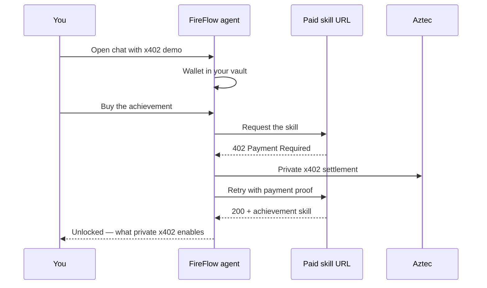

# Live x402 demo

A FireFlow agent paying for an HTTP resource with **x402** on **Aztec** — privately, from a chat.

The **x402 demo** agent buys an agent skill (a markdown achievement file) using a Testnet Stablecoin transfer. You talk to the agent; it handles the wallet, the faucet, and the payment. This page is the map. The protocol those nodes speak is in [FireFlow × x402](./fireflow-x402-specification.md) and [private-stablecoin-specification.md](./private-stablecoin-specification.md).

---

## Where to find it

The agent is listed as **x402 demo** in the [GraphChain marketplace](https://app.graphchain.ai/marketplace).

Open a chat with it. Sign in if you are prompted — the Aztec wallet is created for your account and is not shared with other users.

---

## How to run the demo

Ask the agent what the demo is about, or tell it you are ready. It will guide you. You can pause between steps and ask questions; that is the intended pace.

The path it walks:

1. **Goal** — demonstrate private, agentic payments with x402 on Aztec by buying an achievement skill.
2. **Balance** — the agent checks its Testnet Stablecoin balance.
3. **Faucet** — if the balance is empty, it drips testnet tokens from a faucet contract.
4. **Purchase** — you instruct it to buy the achievement privately.
5. **x402** — the agent pays, receives the skill, and reports what you unlocked.

That last step is the end of the demo. The agent then explains the benefits of private x402 from the skill content.

You do not need a separate Aztec wallet, a bridge, or mainnet funds. This run is testnet.

---

## What you are buying

The paid resource is an **agent skill**: a markdown file the runtime can load after payment. It stands in for any HTTP resource an agent might purchase — an API, a data feed, another skill.

On success you unlock **x402 Private Payments**. The agent uses that file to tell you, in plain language, what the payment just proved: HTTP-native micropayments, confidential settlement on Aztec, and spend controls that belong in an agent runtime.

---

## Behind the scenes

The chat is a FireFlow graph talking to you through a room. On first use the graph **creates an Aztec account for your login**, stores the keys in the FireFlow secret vault, and keeps that wallet scoped to your account. Later sessions reuse the same address.

When you ask it to buy the skill, the graph hits a payment-gated URL. The server answers **HTTP 402**. Under a spend cap, the agent completes a **private** Testnet Stablecoin transfer on Aztec, retries with proof, and receives the file.

Privacy on the Aztec leg: sender, recipient, and amount are not visible on a public explorer. The merchant still learns that *this request* was paid, which is required to serve the resource.

FireFlow is the execution and policy layer (account, faucet, spend cap, settlement). x402 is the HTTP payment standard. Aztec is the private settlement network.

---

## Further reading

| Resource | Role |
| -------- | ---- |
| [FireFlow × x402](./fireflow-x402-specification.md) | How FireFlow agents pay: nodes, spend caps, happy path |
| [Private payments specification](./private-stablecoin-specification.md) | The protocol those nodes speak |
| [x402.org](https://www.x402.org) | HTTP 402 payment standard |
| [aztec.network](https://aztec.network) | Private execution layer |
| [graphchain.ai](https://graphchain.ai) | Agent platform hosting this demo |
| [overcast.fi](https://overcast.fi) | Private payments rail |
| [galactica.com](https://galactica.com) / [docs.galactica.com](https://docs.galactica.com) | Protocol context and product docs |
