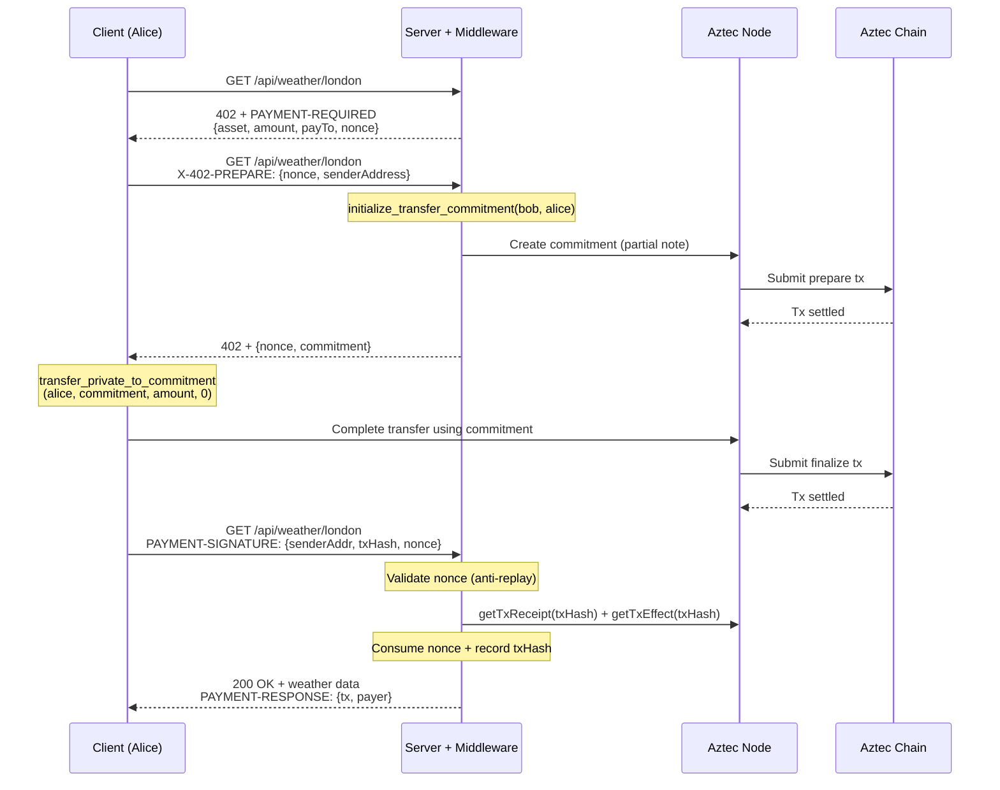
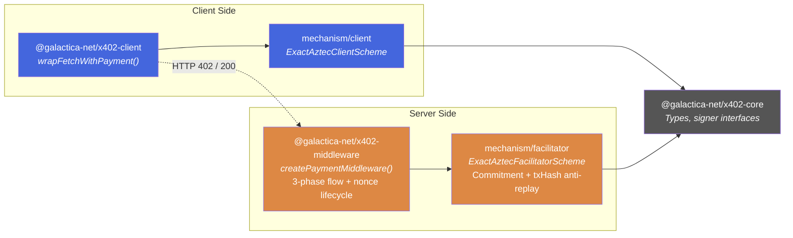

# aztec-x402

x402 payment protocol for Aztec private tokens — HTTP-native micropayments with full transaction privacy.

This monorepo implements the [x402 protocol](https://www.x402.org) for [Aztec](https://aztec.network), allowing any HTTP API to be payment-gated using private stablecoin transfers. All payments use private transfers — sender, receiver, and amount are hidden on-chain.
## Protocol Flow

The x402 protocol uses a 3-phase commitment-based payment flow:



### Commitment Pattern — Structural Recipient Verification

The server creates the commitment via `initialize_transfer_commitment(serverAddr, clientAddr)` on the [AIP-20 standard token contract](https://github.com/AztecProtocol/aztec-standards). This provides two guarantees:

1. **Recipient is bound**: the partial note's `to` = server's address — the client can only complete the transfer TO the server
2. **Completer is bound**: only the specified client address can call `transfer_private_to_commitment` for this commitment

This closes the "who did the payment go to?" verification gap that exists with direct `transfer_in_private`.

### Facilitator Model

In this demo the API provider runs the facilitator inside its own server process. That is different from the common EVM x402 shape where a merchant can ask an external facilitator to verify a prepared payment. For Aztec private payments, the receiver's Aztec account creates the commitment first, so the facilitator needs access to the merchant/server Aztec wallet or to an explicitly delegated service that can create commitments for that merchant. A third-party facilitator is possible later, but it must own that delegation and the retry/rate-limit policy around prepare transactions.

## Token Contract

This project uses the **AIP-20 standard token** from [`@aztec-foundation/aztec-standards`](https://github.com/AztecProtocol/aztec-standards). AIP-20 natively supports the `completer` parameter in `initialize_transfer_commitment(to, completer)`, enabling cross-party commitment flows where the server prepares and the client finalizes.

The demo consumes the published `@aztec-foundation/aztec-standards@5.0.1` token wrapper and artifact directly. There is no checked-in local token artifact or Noir source copy in this repo.

## Aztec Version Compatibility

| Component | Version | Notes |
|-----------|---------|-------|
| SDK (`@aztec/aztec.js` etc.) | `5.0.1` | Aztec advise against `5.0.0` for production |
| AIP-20 token artifact | `@aztec-foundation/aztec-standards@5.0.1` | Built against the same release |
| Public testnet | `5.0.x` | RPC: `https://v5.testnet.rpc.aztec-labs.com` |
| Local network | `5.0.1` | Use Aztec 5.0.x tooling |

### API Notes

Notable points about the Aztec SDK surface this code relies on:

- **`send()`** returns `{ receipt, offchainEffects, offchainMessages }` — txHash is on `receipt.txHash`, not top-level
- **`simulate()`** returns `{ result: Field, offchainEffects, offchainMessages }` — the AIP-20 `initialize_transfer_commitment` returns a raw `Field` (commitment)
- **`offchainMessages`** is preferred when populated; the current fallback still extracts the commitment from `simulate()`
- **Receipts** are a lifecycle union: `status` is block inclusion (`proposed`/`checkpointed`/`proven`/`finalized`), `executionResult` is success/revert — `"success"` is not a status
- **Log lookups** go through `getPrivateLogsByTags` / `getPublicLogsByTags`, which take a query object and return `LogResult[][]`
- **Contract artifacts** must match the SDK/network generation

### Testnet Status

The old devnet blocker is no longer the active target. The demo defaults to Aztec public testnet:

```bash
NODE_URL=https://v5.testnet.rpc.aztec-labs.com \
AZTEC_NETWORK=aztec:testnet \
USE_SPONSORED_FPC=true \
bun run ./packages/demo/src/aztec/setup.ts
```

### Running a Local Network

```bash
# Install Aztec 5.0.x tooling
VERSION=5.0.1 bash -i <(curl -sL https://install.aztec.network/5.0.1)

# Start a local Aztec network
aztec start --local-network
```

## Anti-Replay Protection

The middleware uses a two-layer defense against payment replay attacks:

**Layer 1 — Nonce (middleware):** Each 402 response includes a server-generated UUID v7 nonce in `extra.nonce`. The client echoes it back automatically via `accepted.extra`. The nonce is one-shot (consumed on use) and expires after `maxTimeoutSeconds`. This binds each payment to a specific 402 challenge.

**Layer 2 — txHash Set (facilitator):** The facilitator records every settled txHash. Even if a nonce is somehow bypassed, the same txHash cannot be used twice. Defense-in-depth.

## Package Architecture



| Package | Description |
|---------|-------------|
| `@galactica-net/x402-core` | Types, constants, signer abstractions (`ClientAztecSigner`, `FacilitatorAztecSigner`) |
| `@galactica-net/x402-mechanism` | x402 mechanism plugin — client scheme (sign + transfer) and facilitator scheme (verify + settle) |
| `@galactica-net/x402-middleware` | Express-compatible middleware — 3-phase 402 flow, nonce lifecycle, payment verification |
| `@galactica-net/x402-client` | Fetch wrapper — automatic 402 detection, prepare, payment, and retry |
| `@galactica-net/x402-demo` | Real Aztec demo + mock demo + replay attack test |

## Quick Start

```bash
bun install

# Run tests
bun test

# One-time: deploy accounts + AIP-20 token
# Defaults to public testnet and uses Sponsored FPC for fees
bun run setup

# Start the payment-gated API server
bun run server

# In another shell, run the payment-gated client demo
bun run demo
```

### What happens

1. **`bun run setup`** — generates Schnorr key pairs (`keys.json`), deploys Alice and Bob accounts, deploys the AIP-20 token contract (oUSD), mints 1.0 oUSD to Alice, and writes config to `deploy.json`.

2. **`bun run server`** — starts the local weather API and facilitator. The public hosted demo is not assumed to be current; run the local server against the same `deploy.json` you generated in setup.

3. **`bun run demo`** — Alice pays $0.01 oUSD for a weather resource. The 3-phase flow: (1) client gets 402 with nonce, (2) client sends prepare request with sender address, server creates commitment, (3) client finalizes transfer using commitment, sends txHash to server. Server verifies and returns weather data.

## Known Issues and TODOs

### Simulate/Send Commitment Mismatch

**Status: Known limitation — waiting on Aztec offchain delivery for partial notes.**

`simulate()` and `send()` are independent executions with potentially different randomness. The commitment extracted from `simulate()` may not match the one that goes on-chain via `send()` if Aztec does not return the commitment through `offchainMessages`.

**Mitigations in place:**
- `PXEWallet` uses real account entrypoints for simulation, which aligns randomness with what `send()` does internally — this works in practice on the sandbox but is not a guaranteed fix
- Code is ready to prefer `offchainMessages` when Aztec wires up offchain delivery for partial notes (PR [#20893](https://github.com/AztecProtocol/aztec-packages/pull/20893) added the infrastructure)

**Question for Aztec:** What's the intended pattern for extracting the commitment from an `initialize_transfer_commitment` call? When will `offchainMessages` be populated for partial notes?

### Amount Verification via Completion Log Lookup

When the buyer finalizes a partial note via `transfer_*_to_commitment`, the token
contract emits a completion log keyed by a tag derived from the commitment:

```
log_tag    = poseidon2(commitment ; DOM_SEP__NOTE_COMPLETION_LOG_TAG)
siloedTag  = poseidon2(tokenAddr, log_tag ; PRIVATE_LOG_FIRST_FIELD)
payload    = [siloedTag, storage_slot, value, 0, 0, ...]
```

The facilitator recovers `value` by querying the node for the log with this tag
(`getPrivateLogsByTags` for `complete_from_private`, falling back to
`getPublicLogsByTagsFromContract` for `complete`). The lookup is O(1), keyed by
the unique commitment, and binds the proof to the buyer's tx via `log.txHash` —
so concurrent payments do not interfere with one another and no balance
snapshots are required.

### Payment Attribution

Each 402 challenge includes a server-generated UUID v7 nonce that acts as the invoice/correlation ID. The nonce binds each payment to a specific request and is tracked by the middleware throughout the 3-phase flow. For external invoice correlation, the server can map nonces to its own invoice system via the `extra` field.

### Other TODOs

- [ ] Consume offchain messages when Aztec wires up partial note delivery
- [x] Add `offchain_receive()` client-side hook when offchain messages are populated
- [x] Switch to the published AIP-20 npm package
- [ ] E2e integration test (setup + full payment flow in CI)

## Development

```bash
bun install
bun test        # Run all tests
bun run build   # Build all packages
```

## Environment Variables

| Variable | Default | Description |
|----------|---------|-------------|
| `NODE_URL` | `http://localhost:8080` | Aztec node endpoint |
| `AZTEC_NETWORK` | `aztec:sandbox` | CAIP-2 network id |
| `USE_SPONSORED_FPC` | — | Set to `true` to use Sponsored FPC for gas fees on public networks |
| `SERVER_URL` | `http://localhost:4402` | x402 demo server endpoint (client only) |

## Design Decisions

- **Commitment-based transfers** — server creates commitment (partial note) binding the recipient, client completes the transfer. Provides structural recipient verification.
- **AIP-20 standard token** — uses the [`@aztec-foundation/aztec-standards`](https://github.com/AztecProtocol/aztec-standards) token which natively supports the `completer` parameter for cross-party commitment flows.
- **3-phase HTTP flow** — initial 402 → prepare (server creates commitment) → payment (client finalizes + proves)
- **Commitment-tagged completion log** — server verifies the buyer's payment by looking up the unique completion log emitted by `PartialUintNote::complete{_from_private}`, keyed by the commitment. Concurrent payments are safe.
- **Server = facilitator** — no separate facilitator service; the server verifies and settles payments directly
- **Nonce in `extra` field** — flows through the protocol without any client-side code changes
- **UUID v7 nonces** — time-ordered for debuggability, expire after `maxTimeoutSeconds`
- **PXEWallet over EmbeddedWallet** — uses real account entrypoints for simulation, avoiding the stub-account mismatch that causes different commitments between simulate and send
