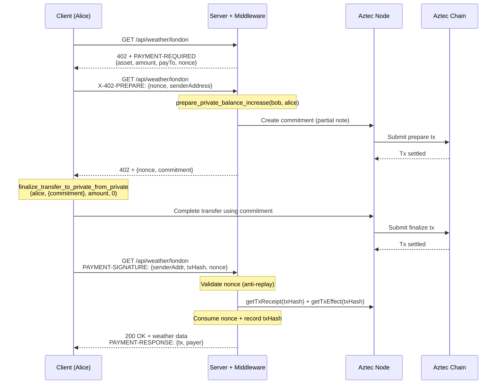

# aztec-x402

x402 payment protocol for Aztec private tokens — HTTP-native micropayments with full transaction privacy.

This monorepo implements the [x402 protocol](https://www.x402.org) for [Aztec](https://aztec.network), allowing any HTTP API to be payment-gated using private stablecoin transfers. All payments use private transfers — sender, receiver, and amount are hidden on-chain.

## Protocol Flow

The x402 protocol uses a 3-phase commitment-based payment flow:



### Commitment Pattern — Structural Recipient Verification

The server creates the commitment via `prepare_private_balance_increase(serverAddr, clientAddr)` on a [forked token contract](#custom-token-contract). This provides two guarantees:

1. **Recipient is bound**: the partial note's `to` = server's address — the client can only complete the transfer TO the server
2. **Completer is bound**: only the specified client address can call `finalize_transfer_to_private_from_private` for this commitment

This closes the "who did the payment go to?" verification gap that exists with direct `transfer_in_private`.

## Custom Token Contract

The official Aztec TokenContract hardcodes `completer = msg_sender()` in `prepare_private_balance_increase`, meaning whoever calls prepare must also call finalize. This blocks our flow where the server prepares and the client finalizes.

We maintain a minimal fork at `packages/contracts/` that adds one parameter:

```diff
- fn _prepare_private_balance_increase(to: AztecAddress) -> PartialUintNote {
-     UintNote::partial(to, slot, context, to, self.msg_sender())
+ fn _prepare_private_balance_increase(to: AztecAddress, completer: AztecAddress) -> PartialUintNote {
+     UintNote::partial(to, slot, context, to, completer)
  }
```

The `completer` parameter only controls who can call finalize for that specific partial note. It cannot steal tokens or change the recipient — both are cryptographically bound. See `packages/contracts/token/src/main.nr` for the full diff.

### Compilation

The contract is compiled using `nargo` + `bb aztec_process` from the Aztec Docker image. The two-step process: (1) nargo compiles Noir to ACIR bytecode, (2) bb transpiles public functions to AVM bytecode and generates verification keys.

```bash
docker run --rm \
  -v ./packages/contracts/token:/contract \
  --entrypoint sh \
  aztecprotocol/aztec:4.1.0-nightly.20260314 \
  -c "
    cd /contract
    /usr/src/noir/noir-repo/target/release/nargo compile --silence-warnings
    /usr/src/barretenberg/ts/build/arm64-linux/bb aztec_process \
      -i target/token_contract-Token.json
  "
```

After `bb aztec_process`, strip the internal function name prefixes:

```bash
node -e "
const fs = require('fs');
const d = JSON.parse(fs.readFileSync('packages/contracts/token/target/token_contract-Token.json', 'utf8'));
for (const fn of d.functions) fn.name = fn.name.replace(/^__aztec_nr_internals__/, '');
fs.writeFileSync('packages/contracts/token/target/token_contract-Token.json', JSON.stringify(d));
"
```

The compiled artifact is checked in at `packages/contracts/token/target/token_contract-Token.json`.

## Aztec Version Compatibility

| Component | Version | Notes |
|-----------|---------|-------|
| SDK (`@aztec/aztec.js` etc.) | `4.1.0-nightly.20260314` | Offchain delivery support, new send/simulate shapes |
| Contract compilation | `aztecprotocol/aztec:4.1.0-nightly.20260314` | nargo 1.0.0-beta.18 + bb |
| Local sandbox | `aztecprotocol/aztec:4.1.0-nightly.20260314` | Full commitment flow works |
| Devnet | `4.0.0-devnet.2-patch.1` | Commitment flow blocked (see below) |

### v4.1.0 API Changes

The v4.1.0 SDK has significant API shape changes from v4.0.x:

- **`send()`** returns `{ receipt, offchainEffects, offchainMessages }` — txHash is on `receipt.txHash`, not top-level
- **`simulate()`** returns `{ result: { commitment }, offchainEffects, offchainMessages }` — commitment is nested under `.result`
- **`offchainMessages`** is present but currently empty (`[]`) for `prepare_private_balance_increase` — the infrastructure for offchain partial note delivery exists (PR [#20893](https://github.com/AztecProtocol/aztec-packages/pull/20893)) but isn't wired up for partial notes yet
- **Contract artifacts** require transpilation via `bb aztec_process` (v4.0.x artifacts fail with "Contract's public bytecode has not been transpiled")

The codebase handles both v4.0.x and v4.1.0 API shapes with fallback logic in `facilitator-signer.ts`.

### Devnet Status

The commitment pattern **does not work on devnet** (`4.0.0-devnet.2-patch.1`) due to a known PXE/simulator bug: `finalize_transfer_to_private_from_private` fails with "Nullifier witness not found". This bug was fixed in v4.0.4 (PRs [#14379](https://github.com/AztecProtocol/aztec-packages/pull/14379), [#14432](https://github.com/AztecProtocol/aztec-packages/pull/14432), [#14533](https://github.com/AztecProtocol/aztec-packages/pull/14533)), but the devnet hasn't upgraded yet.

### Running the v4.1.0 Sandbox

The v4.1.0 sandbox requires an external L1 (Anvil):

```bash
# Terminal 1: start Anvil (auto-mine mode, no --block-time)
anvil --port 8545

# Terminal 2: start the sandbox
docker run -d --name aztec-sandbox \
  -p 8080:8080 \
  -e LOG_LEVEL=info \
  aztecprotocol/aztec:4.1.0-nightly.20260314 \
  start --local-network --l1-rpc-urls http://host.docker.internal:8545
```

Note: v4.1.0 removed the `--sandbox` flag. Use `start --local-network` instead.

## Anti-Replay Protection

The middleware uses a two-layer defense against payment replay attacks:

**Layer 1 — Nonce (middleware):** Each 402 response includes a server-generated UUID v7 nonce in `extra.nonce`. The client echoes it back automatically via `accepted.extra`. The nonce is one-shot (consumed on use) and expires after `maxTimeoutSeconds`. This binds each payment to a specific 402 challenge.

**Layer 2 — txHash Set (facilitator):** The facilitator records every settled txHash. Even if a nonce is somehow bypassed, the same txHash cannot be used twice. Defense-in-depth.

## Package Architecture


| Package | Description |
|---------|-------------|
| `@aztec-x402/core` | Types, constants, signer abstractions (`ClientAztecSigner`, `FacilitatorAztecSigner`) |
| `@aztec-x402/contracts` | Forked Aztec token contract with cross-party commitment support |
| `@aztec-x402/mechanism` | x402 mechanism plugin — client scheme (sign + transfer) and facilitator scheme (verify + settle) |
| `@aztec-x402/middleware` | Express-compatible middleware — 3-phase 402 flow, nonce lifecycle, payment verification |
| `@aztec-x402/client` | Fetch wrapper — automatic 402 detection, prepare, payment, and retry |
| `@aztec-x402/demo` | Real Aztec demo + mock demo + replay attack test |

## Quick Start

```bash
bun install

# Run tests
bun test

# One-time: deploy accounts + custom token on local sandbox
# Requires: Aztec sandbox running (see "Running the v4.1.0 Sandbox" above)
USE_SPONSORED_FPC=true bun run setup

# Run the payment-gated client demo
bun run demo
```

### What happens

1. **`bun run setup`** — generates Schnorr key pairs (`keys.json`), deploys Alice and Bob accounts, deploys the forked x402 token contract (oUSD), mints 1.0 oUSD to Alice, and writes config to `deploy.json`.

2. **`bun run demo`** — Alice pays $0.01 oUSD for a weather resource. The 3-phase flow: (1) client gets 402 with nonce, (2) client sends prepare request with sender address, server creates commitment, (3) client finalizes transfer using commitment, sends txHash to server. Server verifies and returns weather data.

## Known Issues and TODOs

### Payment Attribution

Each 402 challenge includes a server-generated UUID v7 nonce that acts as the invoice/correlation ID. The nonce binds each payment to a specific request and is tracked by the middleware throughout the 3-phase flow. For external invoice correlation, the server can map nonces to its own invoice system via the `extra` field.

### Offchain Partial Note Delivery (v4.1.0)

PR [#20893](https://github.com/AztecProtocol/aztec-packages/pull/20893) added `MessageDelivery.OFFCHAIN` to Aztec. On v4.1.0, `send()` returns `offchainMessages` extracted from the proven tx, which would fix the simulate/send commitment mismatch bug (commitment comes from the same execution that went on-chain).

**Current status**: The infrastructure exists but `offchainMessages` is empty (`[]`) for `prepare_private_balance_increase`. The code is ready to consume offchain messages when they become populated — `facilitator-signer.ts` prefers `offchainMessages` when available and falls back to `simulate()`.

### Simulate/Send Commitment Mismatch (v4.0.x)

On v4.0.x, `simulate()` and `send()` run independently, potentially generating different randomness for the commitment. `PXEWallet` mitigates this by using real account entrypoints (matching what `send()` does internally), but it's not a guaranteed fix. This is fully resolved when offchain delivery is wired up for partial notes.

### Devnet Compatibility

The commitment pattern does not work on devnet (`4.0.0-devnet.2-patch.1`) — see [Devnet Status](#devnet-status). Blocked until devnet upgrades to v4.0.4+.

### Other TODOs

- [ ] Switch to stable v4.1.0 release when available (currently on nightly)
- [ ] Consume offchain messages when Aztec wires up partial note delivery
- [ ] Add `offchain_receive()` client-side call when offchain messages are populated
- [ ] E2e integration test (setup + full payment flow in CI)

## Development

```bash
bun install
bun test        # Run all tests
bun run build   # Build all packages
```

### Recompiling the Token Contract

If you modify `packages/contracts/token/src/main.nr`, recompile using the Docker image:

```bash
# Compile + transpile
docker run --rm \
  -v ./packages/contracts/token:/contract \
  --entrypoint sh \
  aztecprotocol/aztec:4.1.0-nightly.20260314 \
  -c "
    cd /contract
    /usr/src/noir/noir-repo/target/release/nargo compile --silence-warnings
    /usr/src/barretenberg/ts/build/arm64-linux/bb aztec_process \
      -i target/token_contract-Token.json
  "

# Strip internal prefixes
node -e "
const fs = require('fs');
const d = JSON.parse(fs.readFileSync('packages/contracts/token/target/token_contract-Token.json', 'utf8'));
for (const fn of d.functions) fn.name = fn.name.replace(/^__aztec_nr_internals__/, '');
fs.writeFileSync('packages/contracts/token/target/token_contract-Token.json', JSON.stringify(d));
"
```

## Environment Variables

| Variable | Default | Description |
|----------|---------|-------------|
| `NODE_URL` | `http://localhost:8080` | Aztec node endpoint |
| `AZTEC_NETWORK` | `aztec:sandbox` | CAIP-2 network id |
| `USE_SPONSORED_FPC` | — | Set to `true` to use Sponsored FPC for gas fees (required for v4.1.0 sandbox) |
| `SERVER_URL` | `https://aztec-x402.unfazed.engineering` | x402 demo server endpoint (client only) |

## Design Decisions

- **Commitment-based transfers** — server creates commitment (partial note) binding the recipient, client completes the transfer. Provides structural recipient verification.
- **Custom token contract** — minimal fork of official Aztec TokenContract. One parameter added to allow cross-party commitment flows.
- **3-phase HTTP flow** — initial 402 → prepare (server creates commitment) → payment (client finalizes + proves)
- **Tx receipt + tx effect verification** — server verifies the payment transaction settled and produced private notes
- **Server = facilitator** — no separate facilitator service; the server verifies and settles payments directly
- **Nonce in `extra` field** — flows through the protocol without any client-side code changes
- **UUID v7 nonces** — time-ordered for debuggability, expire after `maxTimeoutSeconds`
- **PXEWallet over EmbeddedWallet** — uses real account entrypoints for simulation, avoiding the stub-account mismatch that causes different commitments between simulate and send
- **v4.0.x / v4.1.0 dual compatibility** — API shape detection with fallback logic; ready for offchain delivery when available
