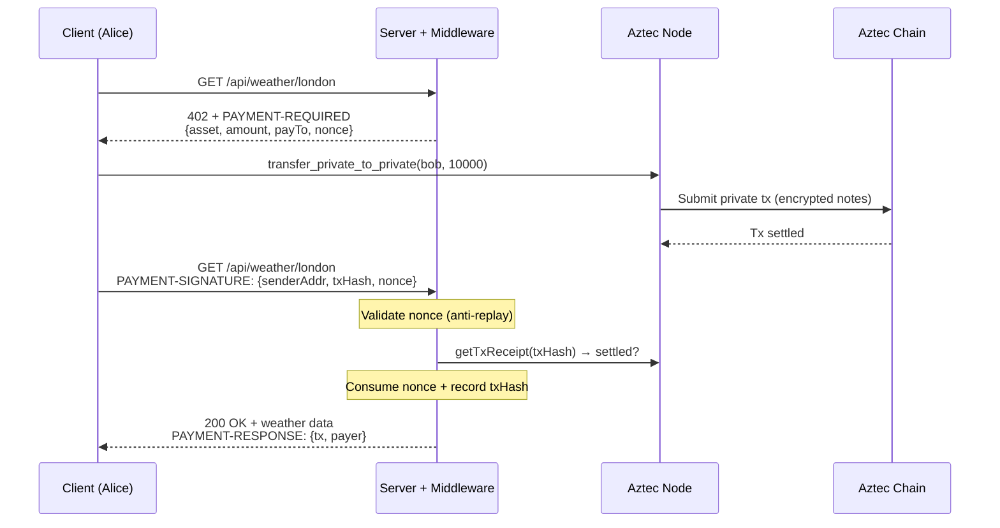
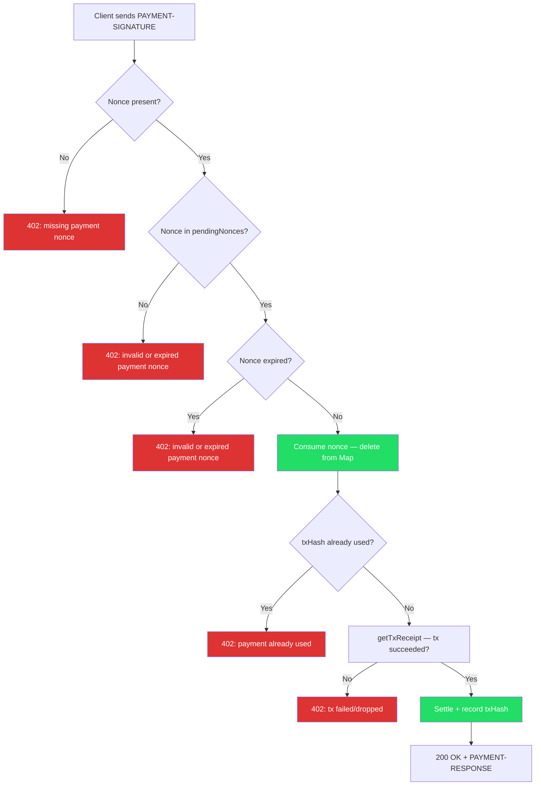

# aztec-x402

x402 payment protocol for Aztec private tokens — HTTP-native micropayments with full transaction privacy.

This monorepo implements the [x402 protocol](https://www.x402.org) for [Aztec](https://aztec.network), allowing any HTTP API to be payment-gated using private stablecoin transfers. All payments use `transfer_private_to_private` — sender, receiver, and amount are hidden on-chain.

## Protocol Flow



## Anti-Replay Protection

The middleware uses a two-layer defense against payment replay attacks:



**Layer 1 — Nonce (middleware):** Each 402 response includes a server-generated UUID v7 nonce in `extra.nonce`. The client echoes it back automatically via `accepted.extra`. The nonce is one-shot (consumed on use) and expires after `maxTimeoutSeconds`. This binds each payment to a specific 402 challenge.

**Layer 2 — txHash Set (facilitator):** The facilitator records every settled txHash. Even if a nonce is somehow bypassed, the same txHash cannot be used twice. Defense-in-depth.

## Package Architecture


| Package | Description |
|---------|-------------|
| `@aztec-x402/core` | Types, constants, signer abstractions (`ClientAztecSigner`, `FacilitatorAztecSigner`) |
| `@aztec-x402/mechanism` | x402 mechanism plugin — client scheme (sign + transfer) and facilitator scheme (verify + settle) |
| `@aztec-x402/middleware` | Express-compatible middleware — 402 responses, nonce lifecycle, payment verification |
| `@aztec-x402/client` | Fetch wrapper — automatic 402 detection, payment, and retry |
| `@aztec-x402/demo` | Mock demo + real Aztec devnet demo + replay attack test |

## Quick Start

```bash
bun install

# One-time: deploy accounts + token on Aztec devnet
bun run setup

# Run the payment-gated client demo
bun run demo

# Test anti-replay protection
bun run demo:replay
```

### What happens

1. **`bun run setup`** — generates Schnorr key pairs (`keys.json`), deploys Alice and Bob accounts on Aztec devnet, deploys an Overcast USD (oUSD) token, mints 1.0 oUSD to Alice, and writes config to `deploy.json`. Only needed once.

2. **`bun run demo`** — Alice pays $0.01 oUSD (private transfer) for a weather resource (e.g. `/api/weather/abc123`). Each unique resource ID requires a separate payment; repeat access to a paid resource is free. The client gets a 402 challenge, sends a private token transfer, and retries with the payment proof. Server verifies the tx on-chain and returns weather data.

3. **`bun run demo:replay`** — sends a payment, then replays the exact same header. First request gets 200, replay gets 402 "invalid or expired payment nonce".

### Mock demo (no blockchain)

```bash
# Terminal 1
bun run ./packages/demo/src/server.ts

# Terminal 2
bun run ./packages/demo/src/client.ts
```

### Deploy server

```bash
docker compose up -d
```

Server runs on port 1005, available at `https://aztec-x402.unfazed.engineering`.

## Development

```bash
bun install
bun test        # Run all tests (84 across 5 packages)
bun run build   # Build all packages
```

## Environment Variables

| Variable | Default | Description |
|----------|---------|-------------|
| `NODE_URL` | `https://v4-devnet-2.aztec-labs.com` | Aztec node endpoint |
| `AZTEC_NETWORK` | `aztec:devnet` | CAIP-2 network id |
| `USE_SPONSORED_FPC` | `true` | Use Sponsored FPC for gas fees |
| `SERVER_URL` | `https://aztec-x402.unfazed.engineering` | x402 demo server endpoint (client only) |

## Design Decisions

- **`transfer_private_to_private` only** — all payments stay fully private on-chain
- **Tx receipt verification** — server verifies the payment transaction settled on-chain via `getTxReceipt`; the ZK proof guarantees correctness of the private transfer
- **Server = facilitator** — no separate facilitator service; the server verifies and settles payments directly
- **Nonce in `extra` field** — flows through the protocol without any client-side code changes
- **UUID v7 nonces** — time-ordered for debuggability, expire after `maxTimeoutSeconds`