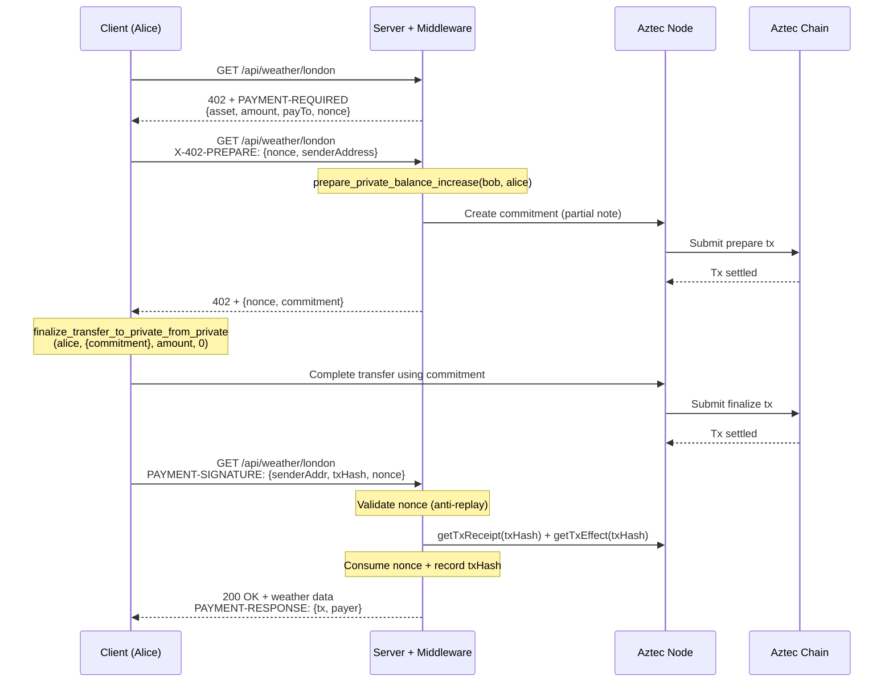

# aztec-x402

x402 payment protocol for Aztec private tokens — HTTP-native micropayments with full transaction privacy.

This monorepo implements the [x402 protocol](https://www.x402.org) for [Aztec](https://aztec.network), allowing any HTTP API to be payment-gated using private stablecoin transfers. All payments use private transfers — sender, receiver, and amount are hidden on-chain.

## Protocol Flow

The x402 protocol uses a 3-phase commitment-based payment flow:



### Commitment Pattern — Structural Recipient Verification

The server creates the commitment via `prepare_private_balance_increase(serverAddr, clientAddr)` on a [forked token contract](#custom-token-contract). This provides two guarantees:

1. **Recipient is bound**: the partial note's `to` = server's address — the client can only complete the transfer TO the server
2. **Completer is bound**: only the specified client address can call `finalize_transfer_to_private_from_private` for this commitment

This closes the "who did the payment go to?" verification gap that exists with direct `transfer_in_private`.

## Custom Token Contract

The official Aztec TokenContract v4.0.4 hardcodes `completer = msg_sender()` in `prepare_private_balance_increase`, meaning whoever calls prepare must also call finalize. This blocks our flow where the server prepares and the client finalizes.

We maintain a minimal fork at `packages/contracts/` that adds one parameter:

```diff
- fn _prepare_private_balance_increase(to: AztecAddress) -> PartialUintNote {
-     UintNote::partial(to, slot, context, to, self.msg_sender())
+ fn _prepare_private_balance_increase(to: AztecAddress, completer: AztecAddress) -> PartialUintNote {
+     UintNote::partial(to, slot, context, to, completer)
  }
```

The `completer` parameter only controls who can call finalize for that specific partial note. It cannot steal tokens or change the recipient — both are cryptographically bound. See `packages/contracts/token/src/main.nr` for the full diff.

### Compilation

The contract is compiled using `aztec-nargo` + `bb aztec_process` from the `aztecprotocol/aztec:4.0.4` Docker image:

```bash
docker run --rm --entrypoint="" \
  -v ./packages/contracts/token:/workspace -w /workspace \
  aztecprotocol/aztec:4.0.4 /bin/bash -c '
    export PATH="/usr/src/noir/noir-repo/target/release:$PATH"
    nargo compile
    /usr/src/barretenberg/ts/build/arm64-linux/bb aztec_process -i target/token_contract-Token.json
  '
```

The compiled artifact is checked in at `packages/contracts/token/target/token_contract-Token.json`.

## Aztec Version Compatibility

| Component | Version | Notes |
|-----------|---------|-------|
| SDK (`@aztec/aztec.js` etc.) | `4.0.4` | Required for partial note nullifier fixes |
| Contract compilation | `aztecprotocol/aztec:4.0.4` | Matching nargo + barretenberg |
| Local sandbox | `aztecprotocol/aztec:4.0.4` | Full commitment flow works |
| Devnet | `4.0.0-devnet.2-patch.1` | Commitment flow blocked (see below) |

### Devnet Status

The commitment pattern **does not work on devnet** (`4.0.0-devnet.2-patch.1`) due to a known PXE/simulator bug: `finalize_transfer_to_private_from_private` fails with "Nullifier witness not found". This bug was fixed in v4.0.4 (PRs [#14379](https://github.com/AztecProtocol/aztec-packages/pull/14379), [#14432](https://github.com/AztecProtocol/aztec-packages/pull/14432), [#14533](https://github.com/AztecProtocol/aztec-packages/pull/14533)), but the devnet hasn't upgraded yet.

- **4.0.4 SDK + devnet node**: fails with "Incorrect verification keys tree root" (VK tree mismatch)
- **4.0.0-devnet.2-patch.1 SDK + devnet node**: prepare succeeds, finalize fails with "Nullifier witness not found"

Expected timeline: devnet upgrade to 4.0.4+ in ~2 weeks. Until then, use local 4.0.4 sandbox for testing the commitment flow.

## Anti-Replay Protection

The middleware uses a two-layer defense against payment replay attacks:

**Layer 1 — Nonce (middleware):** Each 402 response includes a server-generated UUID v7 nonce in `extra.nonce`. The client echoes it back automatically via `accepted.extra`. The nonce is one-shot (consumed on use) and expires after `maxTimeoutSeconds`. This binds each payment to a specific 402 challenge.

**Layer 2 — txHash Set (facilitator):** The facilitator records every settled txHash. Even if a nonce is somehow bypassed, the same txHash cannot be used twice. Defense-in-depth.

## Package Architecture


| Package | Description |
|---------|-------------|
| `@aztec-x402/core` | Types, constants, signer abstractions (`ClientAztecSigner`, `FacilitatorAztecSigner`) |
| `@aztec-x402/contracts` | Forked Aztec token contract with cross-party commitment support |
| `@aztec-x402/mechanism` | x402 mechanism plugin — client scheme (sign + transfer) and facilitator scheme (verify + settle) |
| `@aztec-x402/middleware` | Express-compatible middleware — 3-phase 402 flow, nonce lifecycle, payment verification |
| `@aztec-x402/client` | Fetch wrapper — automatic 402 detection, prepare, payment, and retry |
| `@aztec-x402/demo` | Real Aztec demo + mock demo + replay attack test |

## Quick Start

```bash
bun install

# Run tests (119 tests across 10 files)
bun test

# One-time: deploy accounts + custom token on local sandbox
# Requires: docker run -d -p 8080:8080 aztecprotocol/aztec:4.0.4
bun run setup

# Run the payment-gated client demo
bun run demo
```

### What happens

1. **`bun run setup`** — generates Schnorr key pairs (`keys.json`), deploys Alice and Bob accounts, deploys the forked x402 token contract (oUSD), mints 1.0 oUSD to Alice, and writes config to `deploy.json`.

2. **`bun run demo`** — Alice pays $0.01 oUSD for a weather resource. The 3-phase flow: (1) client gets 402 with nonce, (2) client sends prepare request with sender address, server creates commitment, (3) client finalizes transfer using commitment, sends txHash to server. Server verifies and returns weather data.

## Development

```bash
bun install
bun test        # Run all tests (119 across 10 files)
bun run build   # Build all packages
```

## Environment Variables

| Variable | Default | Description |
|----------|---------|-------------|
| `NODE_URL` | `http://localhost:8080` | Aztec node endpoint |
| `AZTEC_NETWORK` | `aztec:sandbox` | CAIP-2 network id |
| `USE_SPONSORED_FPC` | — | Set to `true` to use Sponsored FPC for gas fees (devnet) |
| `SERVER_URL` | `https://aztec-x402.unfazed.engineering` | x402 demo server endpoint (client only) |

## Design Decisions

- **Commitment-based transfers** — server creates commitment (partial note) binding the recipient, client completes the transfer. Provides structural recipient verification.
- **Custom token contract** — minimal fork of official Aztec v4.0.4 TokenContract. One parameter added to allow cross-party commitment flows.
- **3-phase HTTP flow** — initial 402 → prepare (server creates commitment) → payment (client finalizes + proves)
- **Tx receipt + tx effect verification** — server verifies the payment transaction settled and produced private notes
- **Server = facilitator** — no separate facilitator service; the server verifies and settles payments directly
- **Nonce in `extra` field** — flows through the protocol without any client-side code changes
- **UUID v7 nonces** — time-ordered for debuggability, expire after `maxTimeoutSeconds`
