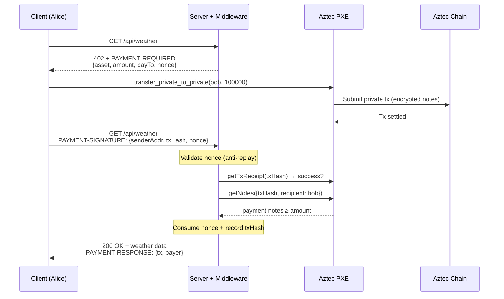
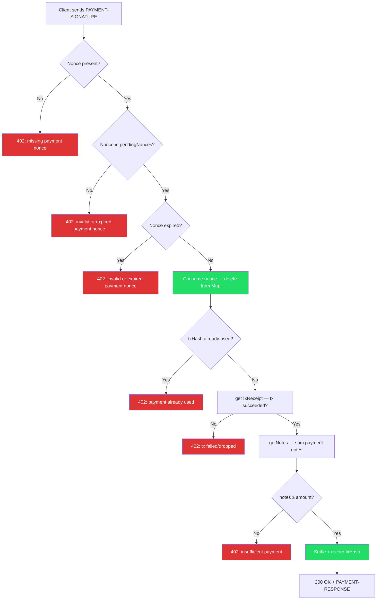
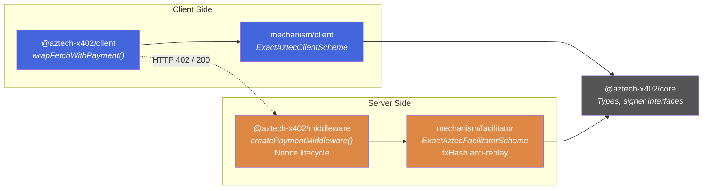

# aztech-x402

x402 payment protocol for Aztec private tokens — HTTP-native micropayments with full transaction privacy.

This monorepo implements the [x402 protocol](https://www.x402.org) for [Aztec](https://aztec.network), allowing any HTTP API to be payment-gated using private stablecoin transfers. All payments use `transfer_private_to_private` — sender, receiver, and amount are hidden on-chain.

## Protocol Flow



## Anti-Replay Protection

The middleware uses a two-layer defense against payment replay attacks:



**Layer 1 — Nonce (middleware):** Each 402 response includes a server-generated UUID v7 nonce in `extra.nonce`. The client echoes it back automatically via `accepted.extra`. The nonce is one-shot (consumed on use) and expires after `maxTimeoutSeconds`. This binds each payment to a specific 402 challenge.

**Layer 2 — txHash Set (facilitator):** The facilitator records every settled txHash. Even if a nonce is somehow bypassed, the same txHash cannot be used twice. Defense-in-depth.

## Package Architecture



| Package | Description |
|---------|-------------|
| `@aztech-x402/core` | Types, constants, signer abstractions (`ClientAztecSigner`, `FacilitatorAztecSigner`) |
| `@aztech-x402/mechanism` | x402 mechanism plugin — client scheme (sign + transfer) and facilitator scheme (verify + settle) |
| `@aztech-x402/middleware` | Express-compatible middleware — 402 responses, nonce lifecycle, payment verification |
| `@aztech-x402/client` | Fetch wrapper — automatic 402 detection, payment, and retry |
| `@aztech-x402/demo` | Mock demo + real Aztec sandbox demo + replay attack test |

## Quick Start (Mock — No Blockchain)

```bash
bun install

# Terminal 1: start mock server
bun run ./packages/demo/src/server.ts

# Terminal 2: call paid API
bun run ./packages/demo/src/client.ts
```

Uses mock signers — proves the full protocol flow without touching a real chain.

## Real Demo (Aztec Sandbox)

Runs actual private token transfers on a local Aztec network.

### Prerequisites

- **Docker** — the Aztec sandbox runs in Docker
- **Node.js v18+** — for the Aztec CLI
- **bun** — for running the demo code

### Step 1: Install and start the Aztec sandbox

```bash
# Install the Aztec toolchain (version 0.87.9)
VERSION=0.87.9 bash -i <(curl -sL https://install.aztec.network)

# Start the sandbox (wait for "Aztec Server listening on port 8080")
aztec start --sandbox
```

### Step 2: Deploy token and fund accounts

```bash
bun install
bun run ./packages/demo/src/aztec/setup.ts
```

This deploys an Overcast USD (oUSD) token, mints 1,000,000 units (1.0 oUSD) to Alice, and writes config to `packages/demo/src/aztec/deploy.json`.

### Step 3: Start the server

```bash
bun run ./packages/demo/src/aztec/real-server.ts
```

Gates `GET /api/weather` behind a 100,000 unit ($0.10) oUSD private payment. Runs on port 4402.

### Step 4: Run the client

```bash
bun run ./packages/demo/src/aztec/real-client.ts
```

Expected output:

```
Connecting to Aztec sandbox at http://localhost:8080...
Payer address: 0x1165...
Balance before: 1000000

Fetching http://localhost:4402/api/weather (payment-gated)...

Response (200):
{
  "location": "Aztec Network",
  "temperature": 21,
  "conditions": "Clear skies, private transactions flowing smoothly",
  "paid": true,
  "network": "aztec:sandbox"
}

Balance after: 900000
Spent: 100000
```

### Step 5: Test anti-replay protection

```bash
bun run ./packages/demo/src/aztec/replay-test.ts
```

Sends a payment, then replays the exact same `PAYMENT-SIGNATURE` header. First request gets 200, replay gets 402 "invalid or expired payment nonce".

## Development

```bash
bun install
bun test        # Run all tests (84 across 5 packages)
bun run build   # Build all packages
```

## Environment Variables

| Variable | Default | Description |
|----------|---------|-------------|
| `PXE_URL` | `http://localhost:8080` | Aztec PXE endpoint |
| `SERVER_URL` | `http://localhost:4402` | x402 demo server endpoint |

## Design Decisions

- **`transfer_private_to_private` only** — all payments stay fully private on-chain
- **Per-transaction note verification** — server uses `getNotes({ txHash })` to verify the specific transaction created payment notes for the recipient, preventing replay via pre-existing balance
- **Server = facilitator** — no separate facilitator service; the server verifies and settles payments directly
- **Nonce in `extra` field** — flows through the protocol without any client-side code changes
- **UUID v7 nonces** — time-ordered for debuggability, expire after `maxTimeoutSeconds`

## Docs

- [Status Report](docs/status-report.md) — sandbox testing log and known issues
- [Anti-Replay (RU)](docs/anti-replay-ru.md) — txHash-based anti-replay explanation (Russian)
- [Full Report (RU)](docs/report-ru.md) — implementation report (Russian)
